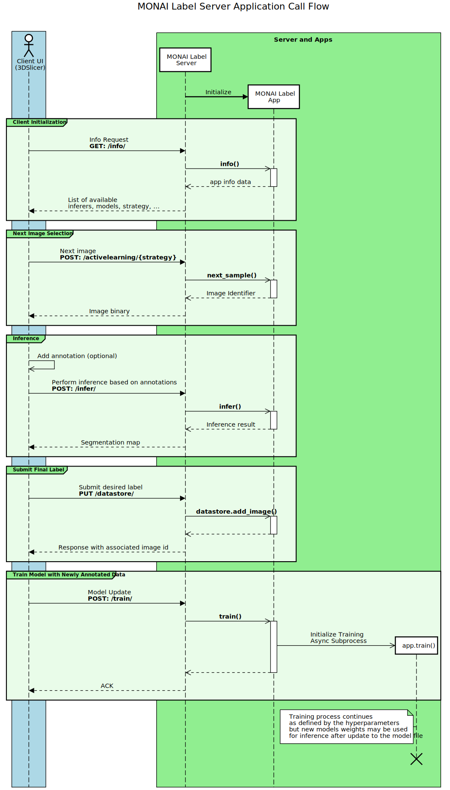
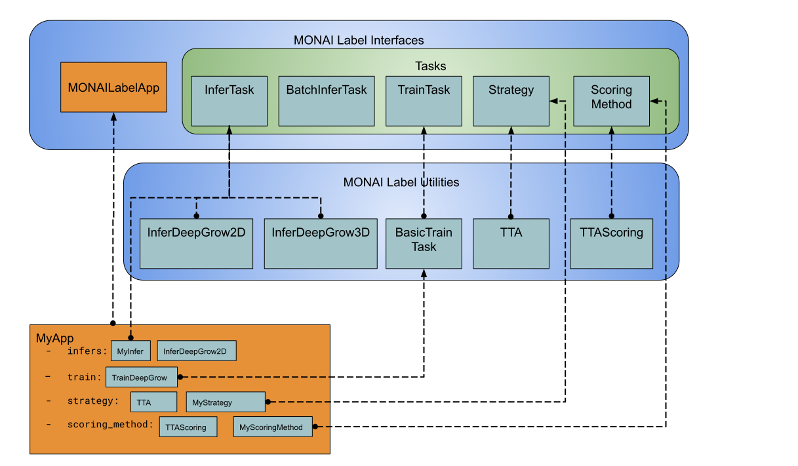

# Description
MONAI Label is an intelligent open source image labeling and learning tool that enables users to create annotated datasets and build AI annotation models for clinical evaluation.  
MONAI Label enables application developers to build labeling apps in a serverless way, where custom labeling apps are exposed as a service through the MONAI Label Server.  
<p align="center"></p>
This Monai ICM version runs the label server in docker-compose.  

# Installation
```bash
cat /proc/driver/nvidia/version # check nvidia driver version
sudo apt install nvidia-utils-510 # install matching nvidia driver
./start.sh init
./start.sh send # Send a test session to orthanc
 # See OpenApi server at http://localhost:45681/ and Annotate the data at http://localhost:45681/ohif
```
Then either :
- Use OHIF : Annotate the data in the DICOM server via the MONAI Label server at http://localhost:45681/ohif (https://docs.monai.io/projects/label/en/latest/quickstart.html#deepedit-annotation-using-ohif)
- Use 3DSlicer plugin : (https://docs.monai.io/projects/label/en/latest/quickstart.html#deepedit-annotation-using-ohif)

# Architecture
https://docs.monai.io/projects/label/en/latest/appdeployment.html
<p align="center"></p>

# Create your Module
MONAI Label aims to allow researchers to build labeling applications in a serverless way.  
This means that MONAI Label applications are always ready-to-deploy via MONAI Label server.  
https://docs.monai.io/projects/label/en/latest/modules.html
<p align="center"></p>

# Monai options
## monailabel
```bash
root@b910e22215a2:/opt/monai# monailabel --help
Using PYTHONPATH=/opt:

usage: monailabel [-h] [-v] {start_server,apps,datasets,plugins} ...

positional arguments:
  {start_server,apps,datasets,plugins}
                        sub-command help
    start_server        Start Application Server
    apps                list or download sample apps
    datasets            list or download sample datasets
    plugins             list or download viewer plugins

optional arguments:
  -h, --help            show this help message and exit
  -v, --version         print version
```

## monailabel start_server
```bash
/opt/monai# monailabel start_server --help
Using PYTHONPATH=/opt:

usage: monailabel start_server [-h] [-a APP] [-s STUDIES] [-v {DEBUG,INFO,WARNING,ERROR}] [-c CONF CONF] [-i HOST] [-p PORT]
                               [--uvicorn_app UVICORN_APP] [--ssl_keyfile SSL_KEYFILE] [--ssl_certfile SSL_CERTFILE]
                               [--ssl_keyfile_password SSL_KEYFILE_PASSWORD] [--ssl_ca_certs SSL_CA_CERTS] [--workers WORKERS]
                               [--limit_concurrency LIMIT_CONCURRENCY] [--access_log] [-l LOG_CONFIG] [--dryrun]

optional arguments:
  -h, --help            show this help message and exit
  -a APP, --app APP     App Directory
  -s STUDIES, --studies STUDIES
                        Studies Directory
  -v {DEBUG,INFO,WARNING,ERROR}, --verbose {DEBUG,INFO,WARNING,ERROR}
                        Log Level
  -c CONF CONF, --conf CONF CONF
                        config for the app. Example: --conf key1 value1 --conf key2 value2
  -i HOST, --host HOST  Server IP
  -p PORT, --port PORT  Server Port
  --uvicorn_app UVICORN_APP
                        Uvicorn App (<path>:<app>)
  --ssl_keyfile SSL_KEYFILE
                        SSL key file
  --ssl_certfile SSL_CERTFILE
                        SSL certificate file
  --ssl_keyfile_password SSL_KEYFILE_PASSWORD
                        SSL key file password
  --ssl_ca_certs SSL_CA_CERTS
                        CA certificates file
  --workers WORKERS     Number of worker processes
  --limit_concurrency LIMIT_CONCURRENCY
                        Max concurrent connections
  --access_log          Enable access log
  -l LOG_CONFIG, --log_config LOG_CONFIG
                        Logging config
  --dryrun              Dry run without starting server
```
